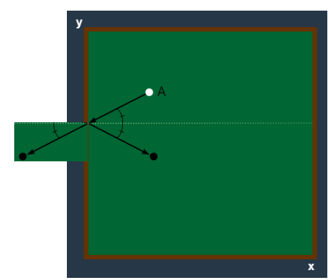

# 당구 연습 풀이

### [문제 링크](https://school.programmers.co.kr/learn/courses/30/lessons/169198)

### 문제 풀이
이 문제는 공의 거리의 최소값의 제곱을 구하는 문제이다. </br>
머쓱이가 친 공이 벽에 부딪힐 때는 항상 입사각과 반사각이 같다.</br>
즉 공이 벽에 부딪혀 생기는 변의 길이를 벽에 대칭이동하여 그리면 아래 그림과 같이 하나의 긴 변이 되는 것을 알 수 있다.</br>

위와 같이 대칭이동하여 생긴 변의 거리를 구한다.

### 소스 코드
```java
public class 당구_연습 {
    public int[] solution(int m, int n, int startX, int startY, int[][] balls) {
        int[] answer = new int[balls.length];
        Point board = new Point(m, n);// 보드판 크기
        Point startPoint = new Point(startX, startY);// 시작 위치
        for (int i = 0; i < balls.length; i++) {
            Point ballPoint = new Point(balls[i][0], balls[i][1]); //공 위치
            List<Point> flip = flip(board, startPoint, ballPoint); // 공의 대칭이동 좌표들
            int minDistance = Integer.MAX_VALUE; // 최솟값
            for (Point point : flip) {
                int distance = twoPointDistance(startPoint, point);//두 점의 거리
                minDistance = Math.min(distance, minDistance);//가장 짧은 거리
            }
            answer[i] = minDistance;
        }
        return answer;
    }
    //공을 대칭이동 하기
    private List<Point> flip (Point board, Point start, Point ball) {
        List<Point> points = new ArrayList<>();
        //각 if 조건 = 벽보다 공을 먼저 만나는 경우 확인
        if (!(ball.x == start.x && start.y > ball.y) )
            points.add(new Point(ball.x, ball.y * -1 ));//보드판 아래 가로 변 대칭
        if (!(ball.y == start.y && start.x > ball.x))
            points.add(new Point(ball.x * -1, ball.y));//보드판 왼쪽 세로 변 대칭
        if (!(ball.x == start.x && start.y < ball.y ))
            points.add(new Point(ball.x, board.y + (board.y - ball.y) ));//보드판 위쪽 가로 변 대칭
        if (!(ball.y == start.y && start.x < ball.x))
            points.add(new Point(board.x + (board.x- ball.x), ball.y));//보드판 오른쪽 세로 변 대칭
        return points;
    }
    // 두 점의 거리 구하기
    private int twoPointDistance(Point start, Point ball) {
        return (int) (Math.pow(Math.abs(ball.x - start.x), 2) + Math.pow(Math.abs(ball.y - start.y), 2));
    }
    class Point {
        int x,y;
        public Point(int x, int y) {
            this.x = x;
            this.y = y;
        }
    }

}

```