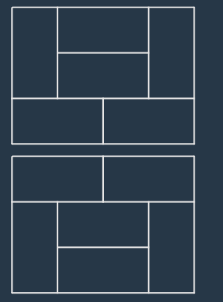

# 3 x n 타일링 풀이

### [문제 링크](https://school.programmers.co.kr/learn/courses/30/lessons/12902)

### 문제 풀이
이 문제는 dp를 이용하여 푸는 문제이다.
가로길이가 홀 수 일 때는 직사각형을 만들 수 없다.
가로길이가 2일 때는 3가지 직사각형을 만들 수 있다.
가로길이 x에 에 대한 직사각형 개수를 f(x) = k 이라 하자.
f(4) 는 f(2) 직사각형에 f(2) 직사각형을 붙인 직사각형이 된다. </br>
f(4) = f(2) * f(2) = 9 가 된다. 하지만 문제를 보면 f(4) = 11 이다. </br>
즉 2가지 직사각형을 빼먹은 것을 알 수 있다. </br>
아래 이미지는 놓친 2가지 직사각형이다. 아래 이미지와 같은 예외적인 직사각형이 f(2)를 제외하고 모두 존재한다.
결국 f(4)는 f(x) = f(x-2) * 3 + 2 가 되는 것을 알 수 있다.
f(6) = f(4) * 3 + 2 + f(2) * 2 이다.
예외적인 직사각형은 가로길이가 2 늘어날 때 마다 2개씩 추가되므로 f(6)에 대하여 f(4) 에 예외적인 직사각형 2개를 붙여 f(4) * 2 가로 길이가 6인 직사각형을 만들 수 있다.
이런식으로 f(2) * 2 를 통하여 직사각형을 만들 수 있다.
결국 f(x) = f(x-2) * 3 + 2 + (f(x-4) + f(x-6) ... + f(2)) * 2 가 된다.

### 소스 코드
```java
public class _3xn타일링 {
    public int solution(int n) {
        int answer = 0;
        long[] dp = new long[n + 1];
        dp[2] = 3;
        long preDp = 0;
        for (int i = 4; i < dp.length ; i+=2) {
            dp[i] = ((dp[i - 2] ) * 3 + 2 + preDp) % 1000000007;
            preDp += dp[i - 2] * 2;
        }
        answer = (int)dp[n];
        return answer;
    }
    //f(2) = f(n-2) * 3 + 2 f(n-4)*2+f....
    public static void main(String[] args) {
        Lv2._3xn타일링 Lv2.삼각_달팽이 = new Lv2._3xn타일링();
        int solution = Lv2.삼각_달팽이.solution(5000);
        System.out.println(solution);
    }
}
```